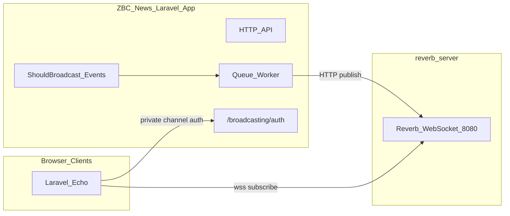

# ZBC News Reverb Server

Dedicated [Laravel Reverb](https://laravel.com/docs/13.x/reverb) WebSocket service for the ZBC News platform. This repository runs only the Reverb process; the main ZBC News Laravel application (separate repo) dispatches broadcast events, runs queue workers, authorizes private channels, and hosts the Laravel Echo client.

## Architecture



| Responsibility | This repo | Main ZBC News app |
|----------------|-----------|-------------------|
| WebSocket server | Yes | No |
| `REVERB_APP_*` credentials | Source of truth | Must match exactly |
| `BROADCAST_CONNECTION=reverb` | Optional | Required |
| Queue worker | No | Required |
| `routes/channels.php` | Stub only | Required |
| Broadcast events | No | Yes |
| Laravel Echo | No | Yes |

## Local development

```bash
cp .env.example .env
php artisan key:generate

# Set REVERB_APP_ID, REVERB_APP_KEY, REVERB_APP_SECRET
# Share the same values with the main ZBC News app

php artisan reverb:start --debug
```

Or run Reverb with the dev helper:

```bash
composer run dev
```

Reverb listens on `ws://localhost:8080` by default.

## Docker

```bash
cp .env.example .env
# populate REVERB_APP_* and other variables

docker compose up --build
```

Or build and run manually:

```bash
docker build -t zbc-reverb .
docker run -p 8080:8080 --env-file .env zbc-reverb
```

Inject environment variables at runtime; do not bake secrets into the image.

## Environment variables

| Variable | Purpose |
|----------|---------|
| `REVERB_APP_ID` | Application ID (shared with main app) |
| `REVERB_APP_KEY` | Public key for WebSocket clients |
| `REVERB_APP_SECRET` | Secret for signing broadcast API requests |
| `REVERB_SERVER_HOST` | Bind address for `reverb:start` (use `0.0.0.0` in Docker) |
| `REVERB_SERVER_PORT` | Bind port for `reverb:start` (default `8080`) |
| `REVERB_HOST` | Public hostname clients and main app use |
| `REVERB_PORT` | Public port (e.g. `443` behind reverse proxy) |
| `REVERB_SCHEME` | `http` locally, `https` in production |
| `REVERB_ALLOWED_ORIGINS` | Comma-separated frontend origins allowed to connect |

Generate credentials once and store them in your secrets manager. The main app must use identical `REVERB_APP_*` values.

## Main ZBC News app integration

### Server-side

In the main Laravel application:

```bash
composer require laravel/reverb
php artisan install:broadcasting --reverb --no-interaction
```

Mirror credentials and public Reverb endpoint:

```dotenv
BROADCAST_CONNECTION=reverb
REVERB_APP_ID=<same as reverb_server>
REVERB_APP_KEY=<same>
REVERB_APP_SECRET=<same>
REVERB_HOST=<public reverb hostname>
REVERB_PORT=443
REVERB_SCHEME=https
```

Ensure a queue worker is always running:

```bash
php artisan queue:work
```

Register broadcast channels in `bootstrap/app.php`:

```php
->withRouting(
    web: __DIR__.'/../routes/web.php',
    channels: __DIR__.'/../routes/channels.php',
    health: '/up',
)
```

Define authorization in `routes/channels.php`:

```php
Broadcast::channel('article.{articleId}', function (User $user, int $articleId) {
    // return true/false or user data for presence channels
});
```

Create events implementing `ShouldBroadcast` (e.g. `ArticlePublished`, `BreakingNewsAlert`).

### Client-side (main app only)

```bash
npm install --save-dev laravel-echo pusher-js
```

Configure Echo in `resources/js/bootstrap.js`:

```js
import Echo from 'laravel-echo';
import Pusher from 'pusher-js';

window.Pusher = Pusher;

window.Echo = new Echo({
    broadcaster: 'reverb',
    key: import.meta.env.VITE_REVERB_APP_KEY,
    wsHost: import.meta.env.VITE_REVERB_HOST,
    wsPort: import.meta.env.VITE_REVERB_PORT ?? 80,
    wssPort: import.meta.env.VITE_REVERB_PORT ?? 443,
    forceTLS: (import.meta.env.VITE_REVERB_SCHEME ?? 'https') === 'https',
    enabledTransports: ['ws', 'wss'],
});
```

Add to the main app `.env`:

```dotenv
VITE_REVERB_APP_KEY="${REVERB_APP_KEY}"
VITE_REVERB_HOST="${REVERB_HOST}"
VITE_REVERB_PORT="${REVERB_PORT}"
VITE_REVERB_SCHEME="${REVERB_SCHEME}"
```

## Production notes

- Terminate TLS at Nginx/Forge and proxy WebSocket traffic to Reverb on port `8080`.
- Set `REVERB_ALLOWED_ORIGINS` to your real frontend domains (not `*`).
- Run Reverb under Supervisor/systemd with auto-restart.
- After deploys: `php artisan reverb:restart`.
- For horizontal scaling: `REVERB_SCALING_ENABLED=true` plus shared Redis.

## Documentation

- [Laravel Broadcasting](https://laravel.com/docs/13.x/broadcasting)
- [Laravel Reverb](https://laravel.com/docs/13.x/reverb)

## License

The Laravel framework is open-sourced software licensed under the [MIT license](https://opensource.org/licenses/MIT).
